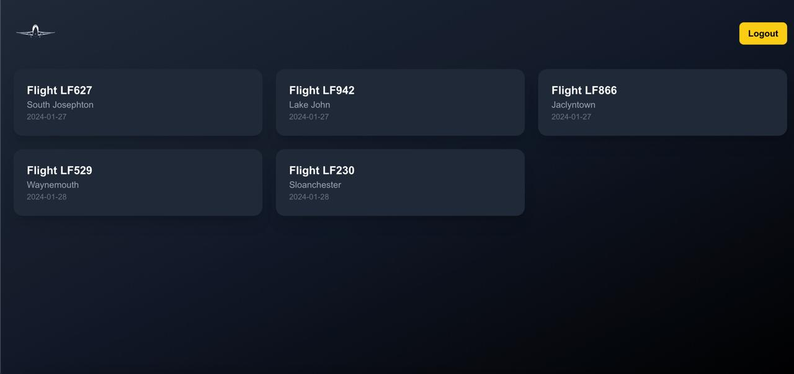
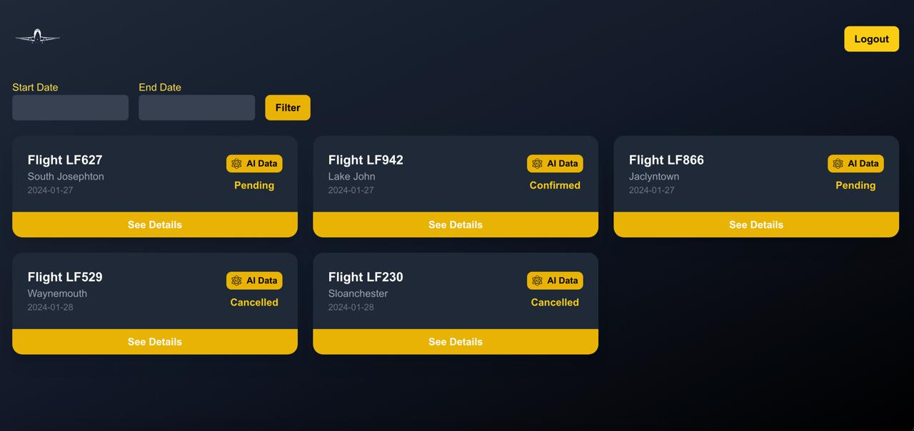

# LumFlights Dashboard Project

## Overview

LumFlights Dashboard is an administrative platform designed for airline staff and administrators to efficiently manage flight reservations. The project provides distinct interfaces tailored to the roles of staff and admin users.

## Key Features

- **Role-Based Access**: The dashboard distinguishes between staff and admin roles, providing tailored functionalities for each.
- **Reservation Management**: Users can view and manage reservations, including detailed customer and flight information.
- **Authentication**: Secure access with role-based authentication to ensure data protection.ss
- **Dynamic Interface**: Intuitive and responsive design for seamless navigation and interaction.

## Screenshots

### Staff Dashboard

1. **Reservations Overview**:

   

   - Displays a list of reservations with essential details like flight number, destination, and status.
   - Expandable cards to view more detailed information about each reservation.

2. **Reservation Details**:

   

   - Includes customer information such as name, age, and email.
   - Displays flight details like departure/arrival times and ticket price.

### Admin Dashboard

1. **Reservations Overview**:

   

   - Similar to the staff dashboard but with additional admin-specific functionalities.

2. **Advanced Controls**:

   

   - Admin users can access more comprehensive tools for managing flights and reservations.

### Login Page

### Homepage

### Reservation Modal

## Technologies Used

- **Next.js** (App Directory): Framework for building the dashboard with server and client-side rendering.
- **JavaScript/TypeScript**: Core programming languages used in the project.
- **Tailwind CSS**: For styling and responsive design.
- **Cookies**: Used for managing authentication tokens.
- **NestJS**: Backend framework for handling business logic and API services.

## Future Enhancements

- **Real-Time Updates**: Enable automatic updates without requiring page refreshes.
- **Analytics Dashboard**: Provide insights into reservations and flight operations.
- **Enhanced Authentication**: Implement features like two-factor authentication.

## Users 
### admin
username: admin
password: admin123

### staff
username: staff1
password: staff123
---

